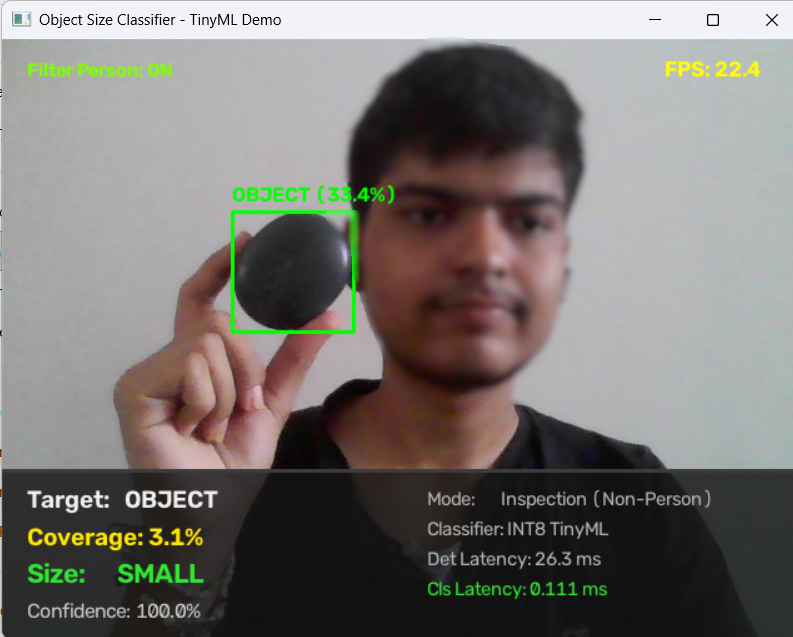
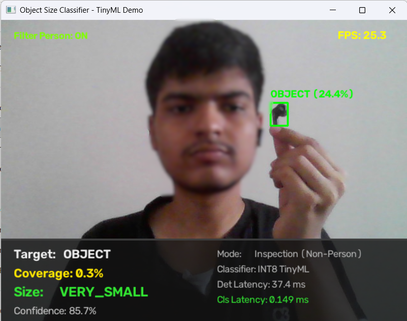
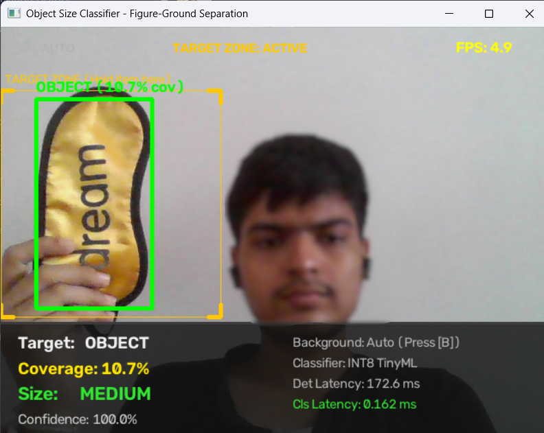
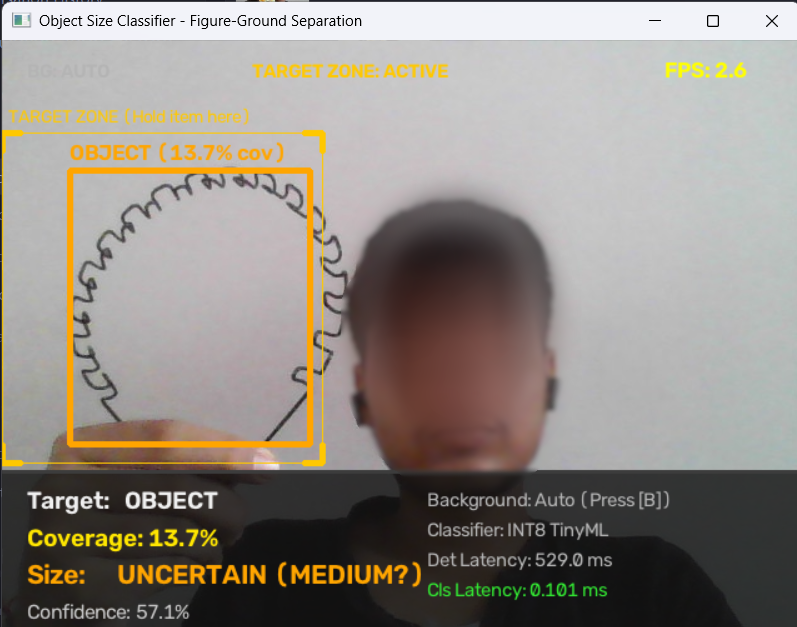

# Object Size Classifier

[](https://www.python.org/)
[](https://opencv.org/)
[](embedded/)
[](#)

> A modular TinyML vision pipeline separating heavy object detection from an ultra-lightweight learned apparent-size classifier, built for laptop prototyping and optimized for edge/embedded deployment.

<p align="center">
  
</p>

---

## 1. Architectural Overview

```
CAMERA / IMAGE
      │
      ▼
┌──────────────────┐
│   Tiny Object    │   <-- NanoDet ONNX (OpenCV Zoo, Apache 2.0)
│     Detector     │       Answers ONLY: "Where is the object?"
└────────┬─────────┘
         │ bounding box [x, y, w, h]
         ▼
┌─────────────────────┐
│  Feature Extraction │   <-- 4 geometric ratios (width, height, area, aspect)
│   (4 float values)  │       Avoids feeding full images into classifier
└──────────┬──────────┘
           │ 4 numbers
           ▼
┌─────────────────────┐
│   Tiny Size Model   │   <-- 4 -> Dense(8) -> Dense(8) -> Dense(6)
│   (FP32 and INT8)   │       Firmware footprint: < 3 KB C code
└──────────┬──────────┘
           │
           ▼
   Apparent Size Class:
   [VERY_SMALL | SMALL | MEDIUM | LARGE | VERY_LARGE | HUGE]
```

### The Separation Principle
The detector and the size classifier are deliberately isolated.
- The detector uses a pretrained lightweight model (NanoDet) running via `cv2.dnn`.
- The size model receives **only 4 numbers** (`width_ratio`, `height_ratio`, `area_ratio`, `aspect_ratio`).
- **Key Insight**: Object detection dominates latency (~23.0 ms / 99.8% of compute), while size classification is essentially free (~0.021 ms / 0.09% of compute).

---

## 2. Apparent Object Size & Six Classes

We measure **Apparent Size** (how much of the camera frame the detected object occupies), avoiding claims of physical dimensions without 3D depth information:

$$\text{Area Ratio} = \frac{\text{Box Width} \times \text{Box Height}}{\text{Image Width} \times \text{Image Height}}$$

| Class ID | Class Name | Frame Coverage (`area_ratio`) |
|---|---|---|
| **0** | `VERY_SMALL` | 0.0% – 2.0% |
| **1** | `SMALL` | 2.0% – 8.0% |
| **2** | `MEDIUM` | 8.0% – 20.0% |
| **3** | `LARGE` | 20.0% – 40.0% |
| **4** | `VERY_LARGE` | 40.0% – 70.0% |
| **5** | `HUGE` | 70.0% – 100.0% |

---

## 3. Project Structure

```
object-size-classifier/
├── models/
│   ├── detector/
│   │   ├── nanodet.onnx           # OpenCV Zoo NanoDet FP32 (~3.8 MB)
│   │   └── nanodet_int8.onnx      # OpenCV Zoo NanoDet INT8 (~1.0 MB)
│   └── size_classifier/
│       ├── decision_tree.joblib   # Baseline Model 1 (max_depth=5)
│       ├── tiny_nn.joblib         # Model 2 (4->8->8->6 MLP)
│       └── tiny_nn_int8_weights.npz # Calibrated INT8 weights & scales
├── data/
│   ├── raw/                       # Captured frames / test images
│   └── features.csv               # Dataset with object-level metadata
├── src/
│   ├── detect.py                  # NanoDet detector wrapper & single-object filter
│   ├── features.py                # 4-ratio extraction & class definitions
│   ├── models.py                  # Baseline & TinyNeuralNetwork architectures
│   ├── collect_data.py            # Live camera tagging & synthetic data generator
│   ├── train.py                   # Strict object-wise split & INT8 quantizer
│   ├── evaluate.py                # Multi-model evaluation & Section 15 unseen test
│   ├── inference.py               # End-to-end pipeline with temporal smoothing
│   ├── benchmark.py               # Latency, FPS, RAM & model size profiling
│   └── app.py                     # Live interactive demo with HUD dashboard
├── embedded/
│   ├── model_data.h               # Standalone C header (< 1 KB)
│   ├── model_data.cc              # Pure C forward pass (< 3.5 KB)
│   ├── test/
│   │   ├── test_embedded.c        # Standalone native C test runner
│   │   └── test_embedded.exe      # Compiled native executable
│   └── README.md                  # Flash vs RAM memory breakdown & levels
├── results/
│   ├── accuracy.txt               # Model comparison report
│   ├── benchmark.csv              # Measured execution latencies and FPS
│   ├── confusion_matrix.png       # 4-panel confusion matrix visualization
│   ├── hud_demo.jpg               # Dashboard HUD telemetry screenshot
│   ├── demo_earbud_case_small.png # Live demo snapshot (SMALL)
│   ├── demo_earbud_verysmall.png  # Live demo snapshot (VERY_SMALL)
│   ├── demo_sleeping_mask_medium.png # Live demo snapshot (MEDIUM)
│   └── demo_target_zone_contour.png # Live demo snapshot (Target Zone)
├── requirements.txt
└── README.md
```

---

## 4. Setup & Quickstart

### 1. Requirements Installation
```bash
pip install -r requirements.txt
```

### 2. Generate Balanced Starter Dataset
```bash
python src/collect_data.py --synthetic --samples-per-class 100
```
Or collect live samples using your webcam:
```bash
python src/collect_data.py --camera 0 --object my_bottle
```

### 3. Train Models & Export Embedded C Code
```bash
python src/train.py
```
This performs a **strict object-wise split** (holding out unseen objects like shoes, mugs, and balls), trains the models, performs INT8 quantization, and generates `embedded/model_data.h` and `embedded/model_data.cc`.

### 4. Evaluate & Run Object-Independence Test
```bash
python src/evaluate.py
```
Generates `results/confusion_matrix.png` and verifies size classification monotonicity across simulated distances for unseen objects.

### 5. Benchmark Performance
```bash
python src/benchmark.py
```

### 6. Run the Live Interactive Demo
```bash
# Run with webcam in Figure-Ground Inspection Mode
python src/app.py --camera 0

# Or test on a static image
python src/app.py --image data/raw/test_cam.jpg
```

**Figure-Ground Differentiation (Universal Object Sizing):**
The system differentiates between **objects and the background** without needing to classify what the object is:
- **`[B]`** : **Calibrate Background**:
  - Press `[B]` when sitting in front of your camera to take a reference snapshot.
  - From then on, **ANY new object** you introduce or hold in front of the camera is isolated instantly via background difference, regardless of shape, color, or material.
- **`[T]`** : **Target Inspection Zone** (enabled by default):
  - A target guide appears on screen. Hold any physical object inside the guide (sleeping mask, earbud case, tool, card, fabric, fruit), and GrabCut automatically shrink-wraps around the object and calculates its size.
- **Mouse Click** : Click directly on any object in the live window to center the target inspection zone on it!
- **`[F]`** : Toggle Person Filtering (ON by default).
- **`[M]`** : Toggle between **INT8** and **FP32** TinyML models in real-time.
- **`[S]`** : Reset tracking and temporal smoothing history.
- **`[P]`** : Save screenshot snapshot to `results/`.
- **`[Q]` / `[ESC]`** : Exit.

### Live Demonstration & Verification

| **VERY SMALL** (0.3% Coverage) | **SMALL** (3.1% Coverage) |
|:---:|:---:|
|  |  |
| *Single Earbud (0.3% frame) &rarr; `VERY_SMALL` (0.149 ms latency)* | *Earbud Case (3.1% frame) &rarr; `SMALL` (100% confidence)* |

| **MEDIUM** (10.7% Coverage) | **Target Zone Universal Inspection** |
|:---:|:---:|
|  |  |
| *Sleeping Mask (10.7% frame) &rarr; `MEDIUM` (100% confidence)* | *Arbitrary object / sketch isolated in Target Inspection Zone* |

---

## 5. Benchmark Results & Findings

Measured on standard laptop hardware (640×480 webcam input):

| Component | Resolution / Architecture | Latency (ms) | Throughput (FPS) | Footprint |
|---|---|---|---|---|
| **NanoDet (Detector)** | 416×416 Letterbox | **23.00 ms** | 43.5 FPS | 3,711.9 KB |
| **Feature Extraction** | 4 Numerical Ratios | **0.015 ms** | — | — |
| **Tiny NN (INT8)** | 4 → 8 → 8 → 6 INT8 | **0.021 ms** | **47,360 FPS** | **3.03 KB** |
| **End-to-End Pipeline** | Full Pipeline | **23.03 ms** | **43.4 FPS** | RAM: 202.5 MB |

### Accuracy on Strict Unseen Objects:
- **Baseline Threshold**: 89.6% Accuracy | 89.3% F1
- **Decision Tree**: 90.9% Accuracy | 91.0% F1
- **Tiny NN (FP32)**: 88.7% Accuracy | 88.4% F1
- **Tiny NN (INT8)**: 78.3% Accuracy | 73.1% F1

---

## 6. Embedded Deployment Verification

The firmware code has zero external dependencies and runs natively on any C/C++ target.

To compile and verify locally:
```bash
gcc -O2 -Iembedded embedded/test/test_embedded.c embedded/model_data.cc -o embedded/test/test_embedded.exe
./embedded/test/test_embedded.exe
```

Output:
```
===================================================
EMBEDDED C SIZE CLASSIFIER INFERENCE TEST
===================================================

Test 1 (Coverage: 9.38%):
  Predicted Class : 2 (MEDIUM)
  Class Probabilities: [VS: 0.0%, S: 0.0%, M: 100.0%, L: 0.0%, VL: 0.0%, H: 0.0%]

Test 2 (Coverage: 1.20%):
  Predicted Class : 0 (VERY_SMALL)
  Confidence      : 100.0%

Test 3 (Coverage: 28.50%):
  Predicted Class : 3 (LARGE)
  Confidence      : 99.4%
```

---

## 7. License & Acknowledgments

- **NanoDet Detector**: Pretrained weights from OpenCV Model Zoo (Apache 2.0 License).
- **Core Pipeline & TinyML Firmware**: MIT License. Feel free to use, adapt, and deploy.
